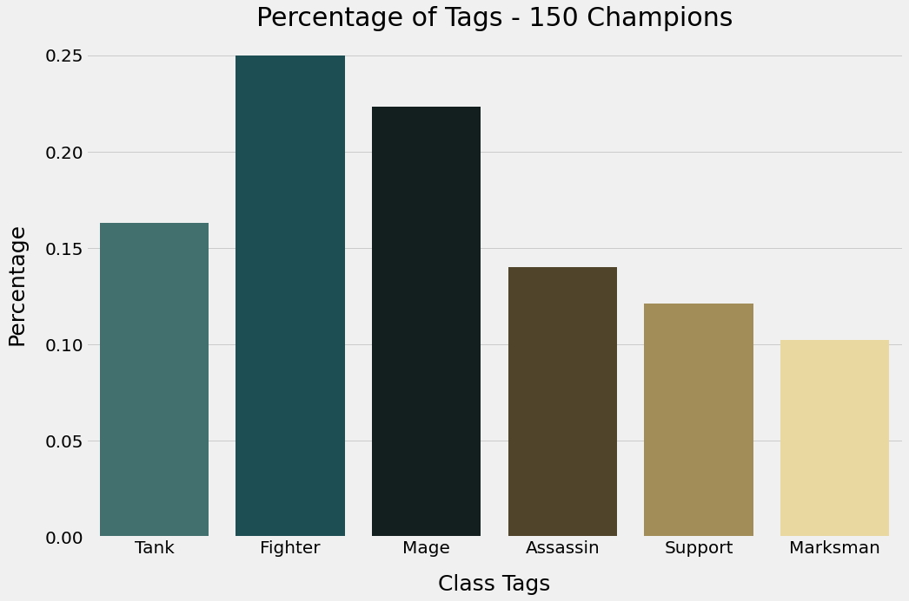
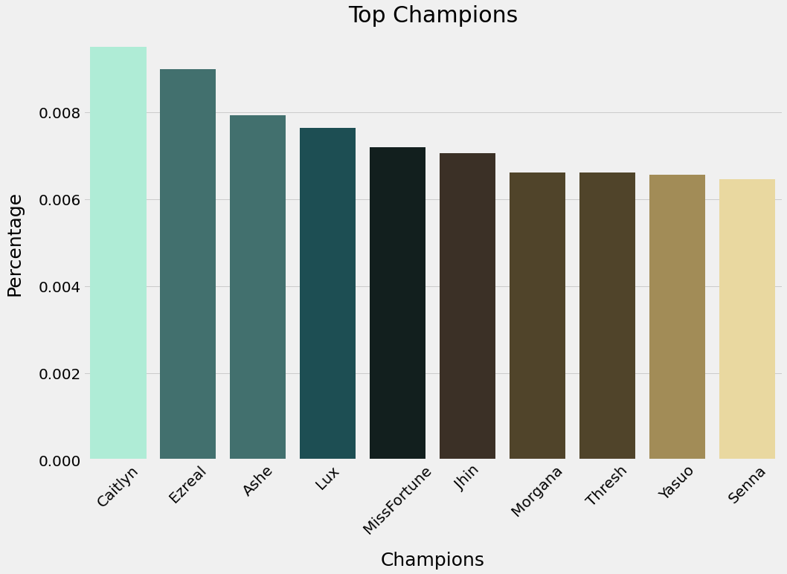

### Features
Because I had never played this game before a lot of reseach was required to understand how it worked and what went into a user picking a champion.

During my research of this game I found that the best way to be able to make accurate recommendations using a User-User recommender would be to look at the type of character a User was playing. There are class tags associated with each champion in the dataset (Tank, Fighter, Mage, Assassin, Support, Marksman), while what lane a user plays does affect the type of champion they would play, this is not always the case and the best way to make a good recommendation is to primarily base the recommender on these characteristics and how it is to be evaluated. The class of a chmpion also affects the items

## EDA
#### Percentage of Tags of the 150 Champions

#### Percentage of Tags of all the Summoners Original Champions

#### Top Champions of the Summoners

## Recommenders and Results

Two recommenders were tested both where User-User based, one looked at similarites in the champions played while another looked at the class type the user played along with stats on the player (Kill, Death, Assist and Win Rate). Because there are so many champions the class type of the recommended Champions and original Champions were evaluted to see if simialr classes were recommended.

For each Recommender a threshold approach and a top simillar approch were used. For threshold the best threshold was found for each recommeder and the top 5 Champions found from those summoners were recommeded. The top simillar approch just looked at the most simialar summoners in order and recommended the Champions found on the top summoner until 5 champions were gathered.

The Original and Predicted Champions were evalueted on tags and the tags were given a percentage as shown in the photo below. RMSE was evalueted for all the individual tags and the mean of all was calulated. RMSE was choosed to determine the variance in class tags found between the original and predicted.

Because of the computing power required to run these recommenders only 20,000 Summoners were tested, below is the scores for each recommender tested.

| Recommender | RMSE |
| --- | --- |
| git status | List all new or modified files |
| git diff | Show file differences that haven't been staged |

## Next Steps
Continuing on this project next would be to create a filtering function that could filter out champions based on the difficulty of that champion to play.
make a web app that could pull data on a user from there summoner name and recommend Champions to try out and play. Along with the recommendations would be to ask Users to rate how well they believe the recommender worked. During my research I found that Champion selection is biased and varies from user to user, to get a better sence of how well the recommender works would be to ask the User.
