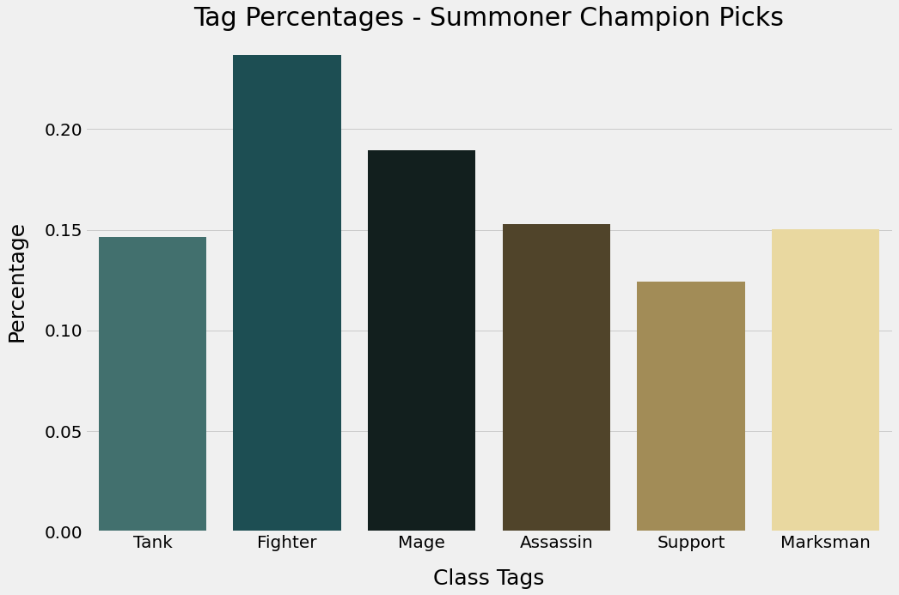

##Introduction

### What is League of Legends?
League of Legends is an online team based game, with five players on each team the goal is to get to the other teams base and destroy the bases' Nexus during each match. Each player chooses from 150 different Champions to play and typically chooses a position to play, these positions indicate where on the map they should be placed and what they should be doing. The bases provide minions that will attack the other players, their turrets, minions and nexus; the bases also allow a player to buy items that will help them during the game. Players can gain gold to buy items by killing other players, their minions and turrets. Games typically last 25-40 mins and about 80 million people play the game world wide.
#### Legend
| Nexus | The core of a teams base, once destroyed ends the game|
| Summoner |User|
| Champions |Characters|
| Minions |Computer Controlled Unit|
| Turrets | Defense Mechanisms that attack the other teams players and minions |
| Items | Helps increase a champions power, and can be bought at the base |
| Class Tags | Each champion has between one and two tags associated with it, these tags explain the abilities, spells, stats, the items a champion generally buys |

### Research
Because I had never played this game before a lot of research was required to understand how it worked and what went into a user picking a champion.

During my research of this game I found that the best way to be able to make accurate recommendations using a User-User recommender would be to look at the type of character a User was playing. There are class tags associated with each champion in the dataset (Tank, Fighter, Mage, Assassin, Support, Marksman), while what lane a user plays does affect the type of champion they would play, this is not always the case and the best way to make a good recommendation is to primarily base the recommender on these characteristics and how it is to be evaluated. The class of a champion also affects the items

## EDA
#### Percentage of Tags of the 150 Champions

#### Percentage of Tags of all the Summoners Original Champions

#### Top Champions of the Summoners

## Recommenders and Results

Two recommenders were tested both where User-User based, one looked at similarities in the champions played while another looked at the percentage of class types the user played along with stats on the player (Kill, Death, Assist and Win Rate). Because there are so many champions the class type of the recommended Champions and original Champions were evaluated to see if similar classes were recommended.

For each Recommender a threshold approach and a top similar approach were used. For threshold the best threshold was found for each recommender and the top 5 Champions found from those summoners were recommended. The top similar approach just looked at the most similar summoners in order and recommended the Champions found on the top summoner until 5 champions were gathered.

The Original and Predicted Champions were evaluated on tags and the tags were given a percentage as shown in the photo below. RMSE was evaluated for all the individual tags and the mean of all was calculated. RMSE was chosen to determine the variance in class tags found between the original and predicted. Below is an example of what was compared between the original and predicted champions.
#### Original

#### Predicted

Because of the computing power required to run these recommenders only 20,000 Summoners were tested, below is the scores for each recommender tested.

#### Top Similar
| Recommender |RMSE|
| --- | --- |
| Similar Champions played |0.195|
| Similar Class Types and Stats |0.164|

#### Threshold
| Recommender - Threshold |RMSE|
| --- | --- |
| Similar Champions played - 0.2|0.139|
| Similar Class Types and Stats - 0.8|0.329|

The Top Similar Recommender, where class types and stats were compared to make the similarity matrix were chosen as the best recommender.

## Next Steps
Continuing on this project next would be to create a filtering function with the best recommender that could filter out champions based on the difficulty of that champion to play.
make a web app that could pull data on a user from their summoner name and recommend Champions to try out and play. Along with the recommendations would be to ask Users to rate how well they believe the recommender worked. During my research I found that Champion selection is biased and varies from user to user, to get a better sense of how well the recommender works would be to ask the User.

